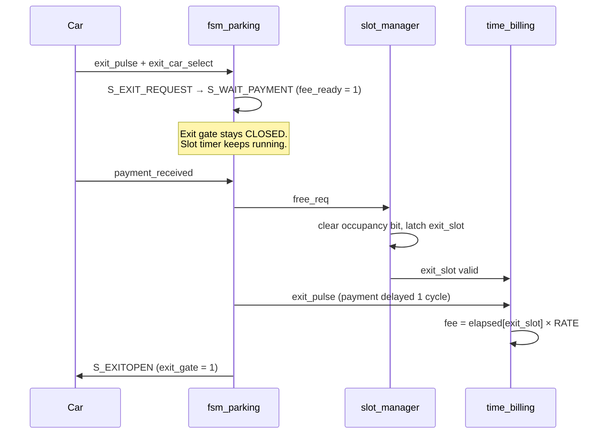

<div align="center">

# 🅿️ Smart Parking Lot System

### A payment-gated, time-billed, 4-slot parking controller written in Verilog HDL


*An FSM-driven RTL design that allocates slots, tracks per-vehicle parking time, calculates fees, and only opens the exit gate once payment is received.*

</div>

---

## 📖 Table of Contents

- [Overview](#-overview)
- [Key Features](#-key-features)
- [System Architecture](#-system-architecture)
- [FSM Controller](#-fsm-controller)
- [Module Breakdown](#-module-breakdown)
- [Exit & Billing Flow](#-exit--billing-flow)
- [Repository Structure](#-repository-structure)
- [Getting Started](#-getting-started)
- [Verification Suite](#-verification-suite)
- [Design Decisions](#-design-decisions)
- [Known Limitations & Roadmap](#-known-limitations--roadmap)
- [Author](#-author)

---

## 🔍 Overview

This project implements a complete **smart parking lot controller** in synthesizable Verilog. It manages a 4-slot lot end to end:

1. A car arrives → the system checks availability, **allocates a free slot**, and opens the entry gate.
2. A **dedicated hardware timer** starts counting for that slot.
3. When the car leaves → the system computes the **parking fee** from the elapsed time and **holds the exit gate closed until payment is received**.
4. On payment → the slot is released, the exit gate opens, and the lot's availability updates.

The design is cleanly partitioned into a **control path** (FSM) and a **datapath** (slot manager + billing engine), wired together by a top-level module. It's verified by five self-checking-style testbenches covering the happy path, full-lot blocking, unpaid exits, wrong-slot selection, and timer restarts.

---

## ✨ Key Features

| Feature | Description |
|---|---|
| 🚗 **Automatic slot allocation** | Priority allocation scans slots 0 → 3 and assigns the first free one |
| 🔒 **Payment-gated exit** | Exit gate opens *only* after `payment_received` — no payment, no exit |
| ⏱️ **Independent per-slot timers** | Four 32-bit counters run in parallel and auto-reset on new occupancy |
| 💰 **Configurable billing** | `fee = elapsed × RATE` with a tunable `RATE` parameter (default `10`) |
| 🚫 **Full-lot protection** | `full_led` asserts and entry is blocked when no slots remain |
| 🛟 **Fallback exit handling** | If the selected exit slot is empty, the system safely releases the first occupied slot instead of deadlocking |
| 🧭 **Clean FSM control** | 6-state controller with registered state and combinational outputs |
| 🔁 **Edge-detected inputs** | Sensors are converted to single-cycle pulses, so held signals can't double-trigger |


---

## 🧠 FSM Controller

The controller is a **6-state FSM** that serializes entry and exit transactions.


> [FSM Architecture](fsm.png) 


| State | Outputs Asserted | Purpose |
|---|---|---|
| `S_IDLE` | `full_led = ~slot_available` | Wait for an entry or exit event |
| `S_ALLOC` | `alloc_req = 1` | Tell the slot manager to reserve a slot |
| `S_GATEOPEN` | `entry_gate = 1` | Let the car in |
| `S_EXIT_REQUEST` | `fee_ready = 1` | Register the exit request |
| `S_WAIT_PAYMENT` | `fee_ready = 1`, `free_req = 1` *on payment* | Hold the gate closed until paid |
| `S_EXITOPEN` | `exit_gate = 1` | Let the car out |

**Safety guards built into the transitions**
- Entry is ignored when `slot_available = 0` (lot full).
- Exit is ignored when `occupancy == 0` (nothing to release).

---

## 🧩 Module Breakdown

### `fsm_parking` — Control Path
Decides *when* things happen. Generates `alloc_req`, `free_req`, both gate signals, `full_led`, and `fee_ready`.

### `slot_manager_4slot` — Occupancy & Allocation

| Port | Dir | Width | Description |
|---|---|---|---|
| `alloc_req` | in | 1 | Allocate the first free slot |
| `free_req` | in | 1 | Release a slot |
| `exit_car_select` | in | 2 | Slot the exiting driver selected |
| `slot_available` | out | 1 | High when at least one slot is free |
| `allocated_slot` | out | 2 | Slot index most recently assigned |
| `occupancy` | out | 4 | One bit per slot (`1` = occupied) |
| `free_count` | out | 3 | Number of free slots (0–4) |
| `exit_slot` | out | 2 | Slot index most recently released |

**Release policy:** if the selected slot is occupied, it is freed. Otherwise, the **lowest-indexed occupied slot** is freed as a fallback so the system never gets stuck.

### `time_billing_4slot` — Timers & Fee Engine

| Port | Dir | Width | Description |
|---|---|---|---|
| `occupancy` | in | 4 | Starts/stops each slot's timer |
| `exit_pulse` | in | 1 | Latch the fee for `exit_slot` |
| `exit_slot` | in | 2 | Which slot's timer to bill |
| `elapsed0..3` | out | 32 | Live elapsed time per slot |
| `fee` | out | 32 | `elapsed[exit_slot] × RATE` |

- Each timer **resets to 0 on a new occupancy** and **freezes on release**, so the final duration stays readable after the car leaves.
- `parameter RATE = 10` sets the cost per time unit.

### `top_parking_system_4slot` — Integration
Instantiates and connects the three blocks above. It also contains a small **registered billing trigger** that delays `payment_received` by one clock so the billing engine samples a valid `exit_slot` (see [Design Decisions](#-design-decisions)).

---

## 💳 Exit & Billing Flow



---

## 📁 Repository Structure

Suggested layout:

```
smart-parking-verilog/
├── rtl/
│   ├── fsm_parking.v
│   ├── slot_manager_4slot.v
│   ├── time_billing_4slot.v
│   └── top_parking_system_4slot.v
├── tb/
│   ├── tb_parking.v
│   ├── tb_parking_full_cycle.v
│   ├── tb_entry_when_full.v
│   ├── tb_fallback_exit.v
│   └── tb_parking_timer_restart.v
├── docs/
│   └── fsm.png
└── README.md
```

---

## 🚀 Getting Started

### Prerequisites
- [Icarus Verilog](https://steveicarus.github.io/iverilog/) (`iverilog`, `vvp`)
- [GTKWave](https://gtkwave.sourceforge.net/) for waveform viewing

```bash
# Ubuntu / Debian
sudo apt install iverilog gtkwave

# macOS
brew install icarus-verilog gtkwave
```

### Run a simulation

```bash
# Compile RTL + a testbench
iverilog -o sim rtl/*.v tb/tb_parking.v

# Run
vvp sim

# View waveforms
gtkwave parking_payment.vcd
```

### Run every testbench

```bash
for tb in tb/*.v; do
    name=$(basename "$tb" .v)
    echo "=== Running $name ==="
    iverilog -o "sim_$name" rtl/*.v "$tb" && vvp "sim_$name"
done
```

> ℹ️ Each testbench dumps its own `.vcd` file (e.g. `entry_when_full.vcd`, `fallback_exit.vcd`, `timer_restart.vcd`).

---

## 🧪 Verification Suite

All testbenches share the same structure: a 10 ns clock, **rising-edge detectors** that turn sensor levels into single-cycle pulses, a DUT instance, a console dashboard, and a directed stimulus sequence.

| Testbench | Scenario | What It Proves |
|---|---|---|
| `tb_parking` | 4 cars enter; slot 3 tries to exit **without paying**, then pays; remaining slots exit with payment | Gate stays closed until payment; timer keeps running while waiting |
| `tb_parking_full_cycle` | Fill the lot, then exit all cars in order 3 → 1 → 2 → 0 | Complete lifecycle; lot returns to empty; fee printed on calculation |
| `tb_entry_when_full` | Fill all 4 slots, then attempt a 5th entry | `entry_gate = 0`, `free_count = 0`, `full_led = 1` |
| `tb_fallback_exit` | 3 cars parked; driver selects **empty slot 3** to exit | System recovers and releases an occupied slot instead of hanging |
| `tb_parking_timer_restart` | Car enters, exits, pays, then **re-enters the same slot** | Timer restarts from 0 on re-entry; fee reflects only the new stay |

### Sample dashboard format

Each testbench prints a live event log to the console, for example:

```
Time | Event                  | Occ | Free | FeeReady | Fee | Gate(E/X)
-----------------------------------------------------------------------
```

Run any testbench to see the full trace for your simulator.

---

## 🎯 Design Decisions

**1. Control / datapath separation.**
The FSM only orchestrates; it never touches timers or occupancy bits directly. This keeps each module small, independently testable, and easy to extend.

**2. Payment-gated slot release.**
`free_req` is issued only from `S_WAIT_PAYMENT` when `payment_received` is high. The slot stays occupied — and its timer keeps running — until the customer actually pays.

**3. Aligned billing trigger.**
The slot manager latches `exit_slot` on the same clock edge that `free_req` takes effect. If billing sampled `exit_slot` on that same edge, it would read the *previous* value. The top module therefore registers `payment_received` by one cycle so billing reads a valid `exit_slot`, while the timer is still holding its final value.

**4. Timer freeze-on-release.**
The elapsed counters stop (rather than clear) when a slot empties, so the last stay's duration remains visible on `e0..e3`. Counters reset only when the slot is occupied again.

**5. Fallback exit path.**
Real users press wrong buttons. Instead of deadlocking on an empty selection, the slot manager falls back to freeing the first occupied slot, keeping the system live.

---


